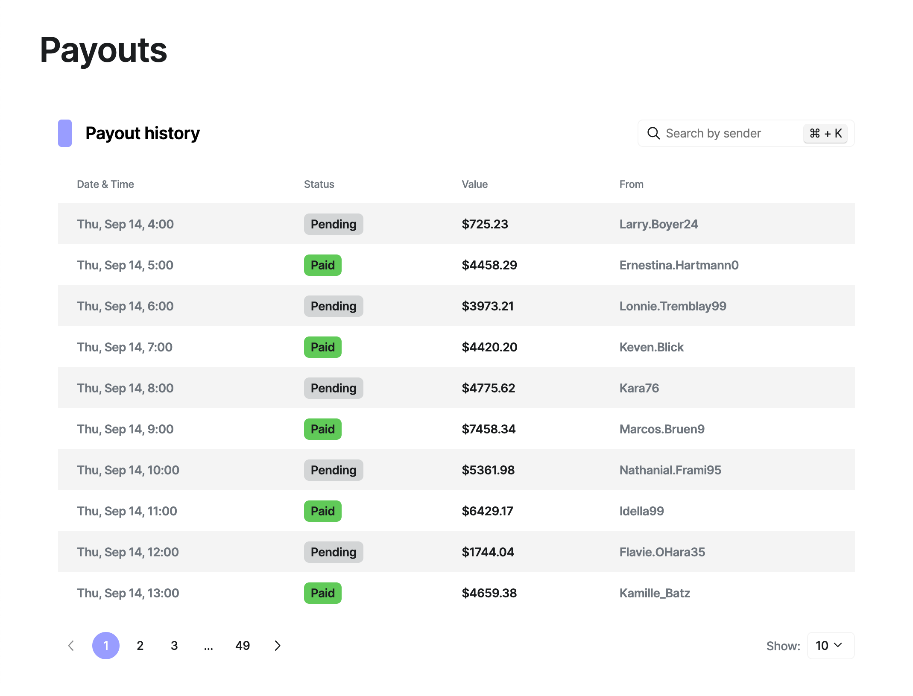

# ZAP Demo

Submittion for [Lithium Ventures FE tech test](https://github.com/Lithium-Ventures/medley-fe-tech-test) from [Artem Gordeev](https://www.linkedin.com/in/artem-gordeev)

## Preview

<Screenshot>

## Stack highlights:

-   `typescript`
-   `styled-components`
-   `react-aria-components` - accessible low level UI primitives.
-   `@tanstack/react-table` - table renderer. Assuming the current feature set, it looks like an overhead, but it's a good foundational layer for the next steps when a product requires more functionality.

## General thoughts

-   There are some discrepancies between the Figma provided and the final result, as I used it only as an initial draft. For example, I came up with consistent [spacing values](./src/libs/theme//index.ts#spacing) and relied on them.
-   There are a few unaddressed `TODO`s across the codebase, as well as look-and-feel ones, that I didn’t address to make completion time reasonable.

## Setup

-   `npm i`

Bootstrapped with [vite](https://vitejs.dev/)

## Available scripts

-   `npm run dev` - run locally
-   `validate/typescript` - check via typescript
-   `validate/lint` - check via eslint
-   `validate/e2e` - run e2e via playwright
